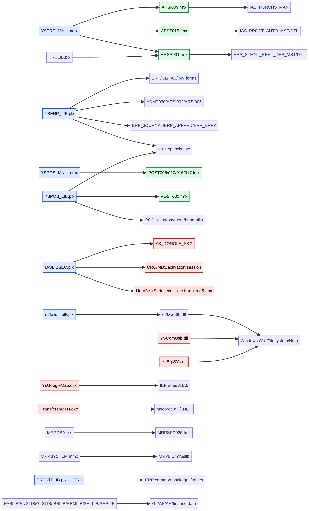

# التقرير الشامل لتحليل `Lib.zip`

**إعداد:** Manus AI  
**التاريخ:** 11 سبتمبر 2026  
**النطاق:** المكتبات والنوافذ والقوائم والملفات التنفيذية والاعتماديات وربطها بنظام Oracle Forms السابق

## 1. الخلاصة التنفيذية

يحتوي `Lib.zip` على طبقة مكتبات تشغيل مشتركة لنظام ERP مبني على Oracle Forms، وليس على ملفات مساعدة بسيطة. يضم الأرشيف 42 ملفًا بإجمالي **46,879,560 بايت**. وتشمل هذه الملفات 26 مكتبة `PLX`، ومكتبتين `PLL`، وثلاث نوافذ `FMX`، وثلاث قوائم `MMX`، وخمس وحدات Windows ثنائية، وملف موارد واحد.

استخراج السلاسل من هذه الملفات نتج عنه **303,045 سلسلة فريدة تقريبًا**، منها **77,478 سلسلة تشبه SQL**، مع **16 اعتمادًا داخليًا تم حله** و**107 اعتماديات لم تُحل داخل الأرشيف**. الاعتماديات غير المحلولة ليست بالضرورة أخطاء؛ فهي غالبًا تشير إلى Forms أو مكتبات أو ملفات تنفيذية موجودة في بيئة التشغيل ولكنها غير مرفقة في `Lib.zip`.

يكشف الأرشيف عن خمس طبقات رئيسية:

1. **طبقة ERP المشتركة:** `YSERP_LIB.plx`, `ERPSTPLIB.plx`, `ERPSTPLIB_TRK.plx`, ومكتبات الإجراءات العامة.
2. **طبقة POS:** `YSPOS_LIB.plx`, `YSPOS_MNU.mmx`, `POSSTP_LIB.plx`، مع وظائف البيع والدفع والفواتير المعلقة والمردود.
3. **طبقة الأمن والتحقق:** `IASLIBSEC.plx`، وتتضمن dongle/serial، التفعيل، CRC/MD5، التحقق من الجلسة والآلة والكائنات.
4. **طبقة المجالات:** المالية، المخزون، المشتريات، الموارد البشرية، التصنيع والتخطيط.
5. **طبقة Windows الأصلية:** DLL وOCX وملف .NET، وتضم USB، النظام، الخرائط، WinHelp، نظام الملفات، والاتصالات الأصلية.

أضيفت إلى الأرشيف ثلاث نوافذ مهمة:

- `APSI009.fmx`: شاشة إدارة هرمية مرتبطة ببيانات `IAS_PURCHS_MAN` وحركة المشتريات.
- `APST015.fmx`: شاشة طلب شراء آلي مرتبطة بـ`IAS_PRQST_AUTO_MST/DTL` والمخزون والمخازن ومراكز التكلفة والمشاريع.
- `HRSS031.fmx`: مصمم تقارير كشوف الموارد البشرية، مع صيغ وقواعد أعمدة ديناميكية مرتبطة بـ`HRS_STMNT_RPRT_DES_MST/DTL`.

لا يمكن استخراج المصدر الكامل من `PLX` أو `FMX` لأن الملفات مجمعة. لذلك فإن أعداد SQL والدوال الواردة هنا هي **مؤشرات جرد** وليست عددًا دقيقًا للتنفيذات. التحليل يثبت أسماء الوحدات والنوافذ والجداول والاستعلامات الظاهرة والعلاقات النصية، لكنه لا يثبت كل Trigger أو كل مسار استثناء أو كل خاصية مرئية.

## 2. المنهجية وحدودها

تم فك الأرشيف في مساحة معزولة دون تعديل الملفات الأصلية. تم فحص النوع والحجم والبصمة SHA-256، واستخراج سلاسل ASCII وUTF-16LE، ثم تصنيف السلاسل إلى أسماء إجراءات، عبارات SQL، أسماء جداول، مراجع ملفات، مؤشرات أمن، ومؤشرات تكامل Windows.

استُخدمت عبارة «SQL-like» للدلالة على سلسلة تحتوي كلمات مثل `SELECT`, `INSERT`, `UPDATE`, `DELETE`, `CREATE`, `ALTER`, `GRANT`, `EXECUTE` أو ما يشابهها. قد تحتوي السلسلة على SQL كامل أو جزء من استعلام أو نسخة مكررة أو بيانات وصفية.

استُخدمت عبارة «procedure-like» للأسماء التي تطابق اصطلاحات النظام، مثل `_PROC`, `_PRC`, `_PKG`, `_FNC`, `_FORM`, `_SCREEN`, أو `_LIB`. وقد تظهر الأسماء أكثر من مرة بسبب تخزين مواصفات Forms والـPackage في مناطق متعددة داخل الملف.

لم يتم تشغيل أي ملف ثنائي، ولم يتم تحميل مكتبة Oracle، ولم يتم الاتصال بقاعدة البيانات، ولم يتم تنفيذ DLL أو OCX أو EXE. وهذا مهم خصوصًا لأن الأرشيف يحتوي على ملفات Windows أصلية وتكاملات USB و.NET.

## 3. جرد الملفات

| الفئة | العدد | الملفات أو الأمثلة | الدور |
|---|---:|---|---|
| PL/SQL Libraries مجمعة | 26 | `ERPSTPLIB.plx`, `MRPDBA.plx`, `MTXLIB.plx`, `HRSLIB.plx` | الإجراءات والحزم المشتركة والمجالات |
| Oracle Forms Windows | 3 | `APSI009.fmx`, `APST015.fmx`, `HRSS031.fmx` | واجهات إدخال واستعلام وتقارير |
| Menu Modules | 3 | `YSERP_MNU.mmx`, `YSPOS_MNU.mmx`, `MRPSYSTEM.mmx` | القوائم والتنقل والاختصارات |
| PLL Libraries | 2 | `calendar.pll`, `d2kwutil.pll` | مكتبات مصدر/تشغيل Forms قديمة |
| Windows DLL | 5 | `YSComUsb.dll`, `YsErpSYs.dll`, `d2kwut60.dll`, `NN60.DLL`, `NNB60.DLL` | تكامل USB والنظام وRuntime/الشبكة |
| ActiveX OCX | 1 | `YsGoogleMap.ocx` | تكامل الخرائط عبر مكونات Windows القديمة |
| Windows/.NET EXE | 1 | `TransferToMTN.exe` | أداة نقل مرتبطة بـ`.NET` |
| موارد | 1 | `FMRUSW.RES` | موارد تشغيل أو واجهة |

### 3.1 أكبر المكونات

| الملف | الحجم | السلاسل التقريبية | SQL-like | الدوال المشابهة | قراءة وظيفية |
|---|---:|---:|---:|---:|---|
| `ERPSTPLIB.plx` | 9,994,240 | 74,057 | 29,288 | 69 | المكتبة العامة الأضخم للنظام |
| `ERPSTPLIB_TRK.plx` | 8,073,216 | 66,108 | 23,077 | 71 | نسخة أو فرع تتبع/تشخيص أو مسار مختلف |
| `MTXLIB.plx` | 5,488,640 | 37,244 | 2,329 | 56 | الخزينة/الحركات/الضمانات/الترحيل |
| `MRPDBA.plx` | 4,796,416 | 33,235 | 14,080 | 126 | إدارة قاعدة بيانات وتخطيط/تصنيع |
| `FNGLIB.plx` | 3,731,456 | 11,031 | 1,021 | 62 | الماليات العامة وإدارة الفترات |
| `HRSLIB.plx` | 3,203,072 | 20,548 | 3,169 | 91 | الموارد البشرية والتقارير والتقييم |
| `APST015.fmx` | 725,020 | 2,413 | 100 | 44 | طلب شراء آلي |
| `APSI009.fmx` | 251,196 | 880 | 30 | 33 | إدارة هرمية للمشتريات |
| `HRSS031.fmx` | 390,428 | 1,096 | 24 | 36 | تصميم تقارير كشوف الموارد البشرية |

## 4. خريطة الترابط العامة



المخطط السابق يوضح العلاقات المثبتة من أسماء الملفات والسلاسل الداخلية. بعض الأسهم تمثل مرجعًا مباشرًا إلى اسم ملف، وبعضها تمثل علاقة وظيفية مستنتجة من أسماء الحزم والجداول والإجراءات. يجب عدم اعتبار العلاقة المستنتجة بديلًا عن فحص `FMB` أو قاعدة البيانات.

### 4.1 نتائج حل الاعتماديات

| المؤشر | القيمة | التفسير |
|---|---:|---|
| إجمالي الاعتماديات النصية | 123 | مراجع ملفات وأدوات مستخرجة من المكتبات والنوافذ |
| اعتماديات محلولة داخل الأرشيف | 16 | الملف المرجعي موجود فعلًا في `Lib.zip` أو الأرشيف السابق |
| اعتماديات غير محلولة | 107 | ملفات تشغيل خارجية أو Forms غير مرفقة أو أسماء Windows قياسية |
| مراجع إلى `YSERP_MNU.mmx` | 3 | `APSI009`, `APST015`, `HRSS031` |
| مراجع POS رئيسية | متعددة | `YSPOS_LIB`, `YSPOS_MNU`, `POST001`, `POST006/010/016/017` |
| مراجع DLL/OCX/EXE | متعددة | Windows، USB، خرائط، .NET، Export، Help |

من الاعتماديات غير المحلولة: `ADMT030.FMX`, `ERP_JOURNAL.FMX`, `ERP_APPRVD_SCR.FMX`, `ERP_VRFY_SCR.FMX`, `POST006.FMX`, `POST010.FMX`, `POST016.FMX`, `POST017.FMX`, `MRPSFC025.FMX`, `Ys_ExpToxls.exe`, `HardDiskSerial.exe`, `crc.fmx`, `md5.fmx`, و`Ys_Itm_Trns.FMX`. هذه الملفات يجب طلبها إذا كان الهدف إعادة بناء كل النوافذ وليس فقط المكتبات.

## 5. تحليل النوافذ والقوائم

### 5.1 `APSI009.fmx`: إدارة `IAS_PURCHS_MAN`

تبدأ الشاشة من `YSERP_MNU.MMX` وتستخدم `YSERP_LIB` ومكتبة `GEN_PKG`. تظهر فيها إجراءات Forms العامة:

- `PRE_FORM_PRC` و`WHEN_NEW_FORM_INSTANCE_PRC` للتهيئة.
- `ADD_PROC`, `ADD_PROC2`, `SAVE_PROC`, `UPDATE_PROC`, و`DELETE_PROC` لدورة CRUD.
- `CHECK_DUPLICATE`, `CHK_B4SAVE_MST_PRC`, و`CHK_B4SAVE_DTL_PRC` للتحقق.
- `KEY_ENTQRY`, `KEY_EXEQRY`, و`LIST_PROC` للاستعلام وLOV.
- `CALL_SCR_PRINT`, `PRINT_PROC`, و`PRINT_PMAN_MOV_PRC` للطباعة.
- `LOAD_TREE` لبناء شجرة المجموعات أو السجلات.
- `CR_VIEW_PMANMOVE` لإنشاء View لحركة المشتريات.

الجدول الأساسي هو `IAS_PURCHS_MAN`. تظهر حقول مثل `PMAN_CODE`, `PMAN_CODE_PARENT`, الاسم العربي والإنجليزي، الدولة، المدينة، المنطقة، الهاتف، الفاكس، الحالة، ونطاقات الضمان أو التعاقد. وجود `PMAN_CODE_PARENT` و`CONNECT BY PRIOR` يثبت أن الشاشة تستخدم بنية هرمية، وليس قائمة مسطحة.

يظهر استعلام توليد الرمز التالي منطقيًا:

```sql
SELECT NVL(MAX(TO_NUMBER(PMAN_CODE)), 0) + 1
FROM IAS_PURCHS_MAN;
```

هذا الأسلوب خطر في الويب وفي التزامن، لأنه قد يولد الرقم نفسه عند تنفيذ عمليتين في الوقت نفسه. في التصميم الحديث يجب استخدام Sequence أو Identity أو خدمة ترقيم ذرية.

تنشئ الشاشة View باسم قريب من `IAS_V_PM_MOVE` لتجميع حركة فواتير الشراء ومردود الشراء، وتربط البيانات بالمورد أو مدير المشتريات وبنوع المستند والعملة والمبلغ. يظهر استخدام `UNION ALL` بين فواتير الشراء والمردود، مع قلب مبلغ المردود إلى قيمة سالبة. عند تحويلها إلى Next.js يجب تحويل الشجرة إلى API مستقل، وتحويل View الحركة إلى Read Model أو SQL View محمية، وتطبيق نطاق الفرع والصلاحيات في الخادم.

### 5.2 `APST015.fmx`: طلب شراء آلي

هذه الشاشة مرتبطة بـ`YSERP_MNU.MMX` وبمسار `NSPC8`. وظيفتها إنشاء وإدارة طلبات شراء آلية، مع رأس وتفاصيل:

- الرأس: `IAS_PRQST_AUTO_MST`.
- التفاصيل: `IAS_PRQST_AUTO_DTL`.
- رقم الوثيقة: `DOC_SER` مع Sequence باسم قريب من `IAS_DOC_SEQ_OTHR`.
- الصنف والوحدة والكمية والمخزن وتاريخ الحاجة.
- مركز التكلفة والمشروع والنشاط.
- نوع الطلب وطريقة الحساب والأولوية والموافقة.

تظهر إجراءات التحقق والكتابة:

- `ADD_PROC` و`ADD_PROC2` لإنشاء رأس وتفاصيل الطلب.
- `B4SAVE_PRC` للتحقق السابق للحفظ.
- `CHECK_DUPLICATE` لمنع تكرار رقم الوثيقة.
- `CHK_B4SAVE_DTL_PRC` للتحقق من الصنف والوحدة والكمية.
- `GET_SERIAL` و`IAS_DOC_SEQ_OTHR.NEXTVAL` للتسلسل.
- `CHECK_PRV_APRVD_FNC` للتحقق من الصلاحية أو الاعتماد.
- `DELETE_PROC` مع فحص اعتماد الطلب أو ارتباطه بطلب صرف.
- `POST_FORMS_COMMIT_PRC` لتحديث المخزن في التفاصيل بعد الحفظ.
- `LOAD_PARAMETERS` لقراءة إعدادات AP وInventory وGL العامة.
- `GENERATE_BARCODE` و`EXP_TO_EXCEL` للتكامل والطباعة والتصدير.

تقرأ الشاشة إعدادات عديدة من `IAS_PARA_AP`, `IAS_PARA_GEN`, `IAS_PARA_INV`, و`IAS_PARA_GL`. من أهمها: توليد الوثيقة والتاريخ، توفر مركز التكلفة، نوع ربط الحسابات، السماح بالمخزون السالب، الخصم، Batch، تاريخ الانتهاء، المشاريع، الأنشطة، اعتماد المستخدم، وصف الصنف، المخزن، الوزن، وقواعد الطلب.

تستخدم الشاشة قوائم اختيار من `Item_Types`, `Ias_Gnr_Code_Dtl`, `S_Hrchy`, `Warehouse_Details`, `cost_centers`, `Ias_Projects`, و`Ias_Actvty`. بعض هذه القوائم تفرض صلاحيات المستخدم عبر جداول `privilege_cc`, `ias_priv_projects`, و`ias_priv_actvty`. لذلك يجب عدم تنفيذ هذه القوائم في React باستعلامات مباشرة؛ بل عبر APIs تتلقى سياق المستخدم وتعيد الخيارات المسموح بها فقط.

الوظيفة الوظيفية المستنتجة هي:

```text
طلب شراء آلي
  → اختيار فترة وفرع ومخزن
  → تحديد نوع الصنف أو الصنف
  → حساب كمية الطلب من المبيعات/المخزون/الحدود
  → ربط مركز التكلفة أو المشروع أو النشاط
  → إنشاء رأس وتفاصيل
  → اعتماد
  → تحويل لاحق إلى طلب شراء أو حركة مستودع
```

### 5.3 `HRSS031.fmx`: مصمم تقارير كشوف الموارد البشرية

تستخدم الشاشة `HRSLIB` و`HRS_GNR_PKG` و`YS_SRL_SCR_PKG`. وهي ليست تقريرًا ثابتًا فقط؛ بل مصمم تقرير قابل للتعريف، حيث يخزن المستخدم مواصفات الرأس والتفاصيل:

- الرأس: `HRS_STMNT_RPRT_DES_MST`.
- التفاصيل: `HRS_STMNT_RPRT_DES_DTL`.
- الصيغ المؤقتة: `DMY_STMNT_RPRT_DES_FORMULA`.
- المقالات أو البنود: `HRS_ARTCL`.

تظهر حقول مثل عنوان التقرير بالعربية والإنجليزية، التذييل، عدد الأعمدة، شروط العرض، ترتيب الأعمدة، التجميع، المجموع، الفواصل، الأصفار، صيغ الأعمدة، وإمكانية إظهار العمود في التقرير.

تحتوي الشاشة على إجراءات مثل `PRO_SET_FORMULA`, `GET_VAL_FORMULA`, `CUT_PAST_ROW`, `CHK_MNDTRY_DTL`, `CHK_DUPLCATE_DTL`, و`GET_MAX_DET_REC`. وتقرأ أو تحلل صيغًا تحتوي عمليات استبدال وأقواس وعلامات وإشارات ونسبًا ومبالغ.

هذه نقطة خطر عالية في التصميم الحديث. إذا تم السماح للمستخدم بكتابة `WHERE` أو `COL_FORMULA` أو SQL حر، فقد تتحول الشاشة إلى قناة SQL Injection أو استخراج بيانات. يجب استبدال الصيغة الحرة بلغة تعبير محدودة AST، تسمح فقط بمجموعة حقول وعمليات معرّفة مسبقًا، مع منع `SELECT`, `DROP`, `EXECUTE`, أسماء الجداول، أو استدعاءات PL/SQL.

### 5.4 `MRPSYSTEM.mmx`: قائمة عمليات التصنيع والتخطيط

تحتوي القائمة على `SAVE`, `PRINT`, `CLEAR`, `EXIT`, `COPY`, `PASTE`, والتنقل بين السجلات، إضافة إلى أوامر Oracle Forms التقليدية مثل `ENTER_QUERY`, `EXECUTE_QUERY`, `CREATE_RECORD`, `DELETE_RECORD`, و`CLEAR_RECORD`. وهي مرتبطة بـ`MRPSLIB`، ما يؤكد أن الأرشيف يشمل جزءًا من MRP وليس فقط ERP المالي.

### 5.5 `YSERP_MNU.mmx`: القائمة العامة

القائمة العامة صغيرة جدًا من ناحية السلاسل، وتحتوي `MAIN_MENU`, `HELP_MENU`, و`WINDOW`. لكنها مهمة بنيويًا لأن النوافذ الثلاث الجديدة تشير إليها مباشرة. هذا يعني أن تشغيل `APSI009`, `APST015`, و`HRSS031` يعتمد على بيئة Forms العامة والقائمة الموحدة، وليس على تشغيل مستقل.

### 5.6 `YSPOS_MNU.mmx`: قائمة POS

تحتوي القائمة على إعدادات POS مثل:

- `USE_HUNG_BILLS` و`DAY_NOTIFY_HUNG_BILL`.
- `USE_DEL_SHIFTF6` و`ALLOW_DEL_ITM_FROM_POS_BILL`.
- `USE_F12_KEY` و`USE_UNDO_CTRLU`.
- `PRINT_PREV_BILL`.
- `PRD_BACK_HOUR`.
- `BRN_YEAR`, `BRN_NO`, `CMP_NO`, `BRN_USR`.
- أنواع البطاقات، النقد، الشيك، المردود، والعملات.

وترتبط بجداول `IAS_PARA_POS`, `IAS_POS_BILL_MST/DTL`, `IAS_POS_RT_BILL_MST/DTL`, `IAS_POS_PAY_BILLS`, `IAS_POS_PAY_CASH`, و`CREDIT_CARD_TYPES`. وتوضح السلاسل أن POS يدعم عدة بطاقات دفع في الفاتورة الواحدة، ومبالغ عمولة البطاقات، والمدفوعات الجزئية، والفواتير المعلقة.

## 6. تحليل المكتبات الأساسية

### 6.1 `YSERP_LIB.plx`: طبقة ERP العامة

تحتوي المكتبة على إجراءات استدعاء الشاشة والشجرة والصلاحيات والـLOV والترجمة والتقارير، ومن أهمها:

- `CALL_MAIN_TREE` و`CALL_SCR_PRC` و`CALL_FRM_TRNS` لاستدعاء النوافذ.
- `SET_MENU_VALUES` و`GET_MAIN_SYS` للقائمة والنظام.
- `IAS_USR_PKG` و`CHK_USR_FRM_PRVIA` للتحقق من صلاحيات الشاشة.
- `SHW_JRNL_DOC`, `ARCHIVES_DOC`, `APPRVD_DOC`, `VRFY_DOC`, و`INACTIVE_DOC` لإدارة وثائق الأستاذ والمراجعة والاعتماد.
- `LOV_PKG` للبحث والقوائم الديناميكية.
- `GEN_PKG_OTHR` و`FORMS_DML` لتوليد أو تنفيذ وظائف Forms العامة.

تستعلم المكتبة عن `FORM_DETAIL` لتحديد رقم النظام ونوع الشاشة واسم الملف ونوع المستند. هذا يعني أن النظام لا يربط كل نافذة في الكود فقط، بل يستخدم قاموس Forms ديناميكيًا لتحديد الشاشة والصلاحيات والتسمية.

### 6.2 `YSPOS_LIB.plx`: طبقة POS التشغيلية

تحتوي المكتبة على دورة حياة فاتورة POS كاملة:

- `OPN_NEW_BILL_SCRN_PRC` لفتح شاشة فاتورة جديدة.
- `ADD_DOC_MNU_PRC` لإنشاء مستند جديد.
- `DEL_ITM_PRC` لحذف صنف.
- `DEL_RCRD_PRC` لحذف سجل.
- `DISC_BILL_AMT_PRC` و`DISC_BILL_PER_PRC` للخصم.
- `HUNG_BILL_PRC` للفواتير المعلقة.
- `PAYMNT_BILL_PRC` و`MULTI_PAYMNT_BILL_PRC` للدفع.
- `PRNT_MIN_BILL_PRC`, `PRNT_NORML_BILL_PRC`, و`PRNT_OLD_BILL_PRC` للطباعة.
- `PRNT_REST_HUNG_BILL_PRC` لاستعادة فاتورة معلقة.
- `CHANGE_USER` لتغيير المستخدم.
- `START_UP_MNU_PRC` لتهيئة قائمة POS.

تظهر صلاحيات حذف الصنف أو السجل، التراجع، تغيير المستخدم، استعادة الفواتير، وطباعة فاتورة قبل الحفظ. يجب إعادة تصميم هذه الوظائف في الويب على شكل حالات صريحة: `DRAFT`, `HELD`, `SUBMITTED`, `PAID`, `VOIDED`, `REVERSED`، بدل أعلام عامة وأوامر لوحة مفاتيح مخفية.

### 6.3 `IASLIBSEC.plx`: الأمن والتفعيل وسلامة الملفات

هذه المكتبة شديدة الحساسية. تحتوي على:

- `YS_DONGLE_PKG` و`GET_DONGLE_SERIAL_NO1/2`.
- `SET_PARAM_FOR_DONGLE`.
- `CHECK_EXE` و`CHK_CRC_MD5`.
- قراءة `parameter.crc`, `parameter.md5`, و`parameter.sec_size`.
- التحقق من ملفات `crc.fmx` و`md5.fmx`.
- `CALL_ACTIVATION_SCREEN` و`activation_code`.
- قراءة `TERMINAL`, `OS_USER`, و`SERVER_HOST`.
- فحص `V$SESSION`, `DBA_USERS`, `USER_DB_LINKS`, و`ALL_OBJECTS`.
- `CHECK_OBJECT_SETUP`, `CHECK_ALL_OBJECTS_SETUP`, و`MY_FORMS_DDL`.
- `GET_SESSION_INFO`, `REGISTER_SESSION_VALS`, و`REINFORCE_SEC`.

وجود `DBMS_DDL` و`DBA_USERS` و`USER_DB_LINKS` و`V$SESSION` داخل مكتبة أمن العميل يعني أن الأمن مرتبط مباشرة بقاعدة البيانات وبآلة التشغيل. في البديل يجب نقل هذه الوظائف إلى خدمة هوية وتسجيل مركزية، مع Vault وMFA وسجل جلسات، وعدم جعل المتصفح أو العميل مسؤولًا عن dongle أو CRC أو قتل الجلسات.

### 6.4 `ERPSTPLIB.plx` و`ERPSTPLIB_TRK.plx`

هما أكبر مكونين في الأرشيف. كثافة SQL فيهما لا تعني أنهما يحتويان على كل منطق ERP فقط؛ قد تتضمن وثائق PL/SQL المدمجة، نصوص أدوات التطوير، سكربتات الجداول، وحزمًا متعددة. لكن الحجم والأسماء يثبتان أنهما طبقة أساسية مشتركة.

وجود نسختين، إحداهما باسم `_TRK`، يتطلب مقارنة رسمية قبل اختيار نسخة الترحيل. لا يجوز افتراض أن `_TRK` نسخة اختبار أو نسخة أحدث دون مقارنة:

- قائمة الحزم والدوال.
- الاستعلامات والـDDL.
- الجداول والحقول الجديدة.
- سلوك الصلاحيات.
- فروق `COMMIT` و`ROLLBACK`.
- الاستدعاءات إلى Forms الخارجية.

### 6.5 `MRPDBA.plx` و`MRPLIB.plx` و`MTXLIB.plx` و`PMSLIB.plx`

تكشف هذه المجموعة وجود نطاق تصنيع وتخطيط وخزينة/حركات داخل النظام. `MRPDBA.plx` يحتوي على عدد كبير من الدوال المشابهة، منها إجراءات إنشاء الجداول والحزم والمشغلات والفهارس والنماذج. لذلك لا ينبغي اعتبار MRP وحدة تقارير فقط؛ بل هناك مؤشرات على إدارة مخطط قاعدة البيانات وإنشاء كائنات.

`MTXLIB.plx` يحتوي على مفاهيم مثل:

- `AUTO_JV_POST_TO_GL`.
- `DOC_POST`, `DOC_CLOSE`.
- `OUT_SEP_ACCT_POST`, `OUT_SEP_CHK_POST`, `OUT_SEP_CSH_POST`, و`OUT_SEP_TRUST_POST`.
- `PAY_POST` و`SPRT_POST_IN_PAY_VCHR`.
- أرقام تأمين وحركات دخول وخروج.
- تقييد المستخدمين وحركاتهم.

هذه المؤشرات تربط الخزينة والتأمين والشيكات والترحيل بالأستاذ العام. عند نقل النظام، يجب عدم فصل AR عن هذه الوظائف قبل تحديد تأثير القبض والشيكات والضمانات على GL.

### 6.6 `HRSLIB.plx`

تحتوي على إجراءات HR واسعة، من بينها `HRS_POSTING_PKG`, `HRS_INSRT_FORM_DTL_*`, `HR_TABLE_PRC_*`, `HR_VIEW_PRC_*`, و`HR_TRIGGER_PRC_*`. كما تظهر جداول النماذج والتقييم والاختبارات والحضور والخصوصيات. يرتبط `HRSS031.fmx` بهذه المكتبة وبمصمم التقارير.

### 6.7 مكتبات الماليات

تشمل `FASLIB`, `FNGLIB`, `GLSLIB`, `IBSLIB`, `REMLIB`, `SHLLIB`, و`SHPLIB`. تظهر فيها مؤشرات الفترات والإقفال والترحيل والحسابات والـLOV والأستاذ العام وتوثيق النماذج. وجود `IAS_POST_MST`, `IAS_POST_DTL`, و`IAS_POSTING_PKG` في أكثر من مجال يدل على أن الترحيل موزع على مكتبات المجال، لكنه يعتمد على نواة مشتركة.

## 7. الملفات الأصلية Windows

### 7.1 خصائص عامة

كل الملفات التنفيذية وDLL/OCX في الأرشيف معرفة كـ**PE32 Intel 80386**، حتى الملفات الموضوعة في مجلد اسمه `64-bit-dll`. هذا يعني أنها مكونات 32-bit وليست 64-bit بالضرورة. تشغيلها على بيئة حديثة قد يتطلب Oracle Forms Runtime 32-bit أو طبقة توافق.

| الملف | النوع | ملاحظات |
|---|---|---|
| `YSComUsb.dll` | PE32 DLL | يستورد Windows GUI وOLE وShell، ومخصص للتكامل مع USB أو أجهزة محلية |
| `YsErpSYs.dll` | PE32 DLL | يستورد WTS API، وهو مؤشر إلى جلسات Terminal Services أو Remote Desktop |
| `d2kwut60.dll` | PE32 DLL | Runtime/أدوات Forms قديمة مرتبطة بالملفات والواجهة وWinMM |
| `YsGoogleMap.ocx` | PE32 ActiveX | يعتمد على `MSVBVM60.DLL`, `VBA6.DLL`, و`ieframe.dll` |
| `TransferToMTN.exe` | PE32 .NET | ملف GUI Mono/.NET مرتبط بـ`mscoree.dll` |
| `NN60.DLL`, `NNB60.DLL` | PE32 DLL | مكونات طرفية/شبكية داخل مجلد `64-bit-dll`، وتعتمد على DLLs قديمة أخرى |

### 7.2 المخاطر

تسبب هذه المكونات اعتمادًا قويًا على Windows، وتمنع تحويل النظام إلى Web خالص دون إعادة تصميم. `YsGoogleMap.ocx` يعتمد على Internet Explorer/Visual Basic 6، و`d2kwutil` يعتمد على Runtime قديم، و`YSComUsb.dll` يحتاج إلى جهاز أو Driver محلي، و`YsErpSYs.dll` قد يقرأ معلومات جلسة Windows.

الحل الحديث هو عزل هذه الوظائف خلف Agent محلي أو خدمة أجهزة محدودة، مع توقيع الملفات، وتسجيل العمليات، ومنع تحميل DLL من مجلدات قابلة للكتابة. أما الخرائط فتنقل إلى Web Map API حديثة، ولا تُشغل OCX داخل المتصفح.

## 8. الترابط مع ملفات FMX السابقة

تدعم المكتبات الجديدة النتائج السابقة ولا تنقضها. أهم الروابط هي:

| الرابط | الدلالة |
|---|---|
| `YSERP_MNU.mmx` ← `APSI009/APST015/HRSS031` | النوافذ الثلاث تعمل داخل القائمة العامة نفسها |
| `YSERP_LIB.plx` ← شاشات `ERP`, `GL`, `FAS`, `INV`, `ERP_JOURNAL` | مكتبة ERP العامة مسؤولة عن استدعاء النوافذ والصلاحيات والتقارير |
| `YSPOS_LIB.plx` ← `POST001.fmx` | POS يعتمد على مكتبة مخصصة للفواتير والدفع والمردود والفواتير المعلقة |
| `YSPOS_MNU.mmx` ← `POST006/010/016/017` | قائمة POS تشير إلى نوافذ غير مرفقة تحتاج إلى الحصول عليها |
| `IASLIBSEC.plx` ← `crc.fmx`, `md5.fmx`, `HardDiskSerial.exe` | طبقة الأمن مرتبطة بملفات تحقق خارجية وبمعرف الجهاز |
| `MRPDBA.plx` ← `MRPSFC025.fmx` | إدارة التصنيع/قاعدة البيانات تستدعي نافذة MRP خارج الأرشيف |
| `d2kwutil.pll` ← `d2kwut60.dll` و`F45RUN32.EXE` | اعتماد Forms Runtime وأدوات قديمة خارج الأرشيف |

الملفات السابقة `POSLGN.fmx`, `IASADMT022.fmx`, `ADMT022.fmx`, `ADMT0222.fmx`, `IASInstall_Pos.fmx`, `OPEN_PASS_YSERP.fmx`, و`ACTIVE_UNPOSTING.fmx` كانت تكشف نقطة الدخول والإقفال والمزامنة وإلغاء الترحيل. `Lib.zip` يشرح الآن أين توجد الخدمات المشتركة التي تستدعيها تلك النوافذ، خصوصًا `YSERP_LIB`, `YSPOS_LIB`, `IASLIBSEC`, `d2kwutil`, و`ERPSTPLIB`.

## 9. تقييم المخاطر

تم بناء ترتيب أولي للمخاطر بناءً على وجود أسرار أو صلاحيات DDL أو SQL ديناميكي أو تحكم بالجلسة أو تكامل Windows، إضافة إلى حجم SQL-like. هذا الترتيب ليس عدد ثغرات، بل أداة لتحديد الأولويات.

| الأولوية | المكون | سبب التقدم |
|---|---|---|
| حرجة | `ERPSTPLIB.plx` و`ERPSTPLIB_TRK.plx` | أكبر مساحة SQL ومؤشرات DDL وصلاحيات وSQL ديناميكي |
| حرجة | `MRPDBA.plx` | 14,080 SQL-like و126 اسم إجراء ومؤشرات إدارة مخطط |
| عالية | `IASLIBSEC.plx` | dongle، CRC/MD5، التفعيل، جلسة النظام، DBA metadata |
| عالية | `YSPOS_LIB.plx` و`YSPOS_MNU.mmx` | حذف صنف/سجل، فواتير معلقة، دفع متعدد، تغيير مستخدم |
| عالية | `APST015.fmx` | كتابة طلبات شراء وربط مخزون ومخازن ومشاريع واعتماد |
| عالية | `HRSS031.fmx` | صيغ تقارير ديناميكية يمكن أن تتحول إلى SQL حر |
| متوسطة | `YSComUsb.dll`, `YsErpSYs.dll`, `YsGoogleMap.ocx` | اعتماد Windows وOLE وDrivers وActiveX |
| متوسطة | `MTXLIB.plx` | ترحيل خزينة وشيكات وضمانات إلى GL |
| متوسطة | `HRSLIB.plx` | وظائف HR واسعة وترحيل وتقارير وصلاحيات |

## 10. تحويل النوافذ والمكتبات إلى React/Next.js

### 10.1 القاعدة المعمارية

لا يجب تحويل `PLX` إلى JavaScript بشكل مباشر. يجب تحويل كل نافذة إلى **مواصفة نطاق** ثم إلى API ثم إلى واجهة React.

```text
Next.js / React
      ↓ HTTPS
API Gateway + RBAC
      ↓
Domain Services
      ├── Purchasing Management
      ├── Automatic Purchase Requests
      ├── HR Report Designer
      ├── POS
      ├── AR/GL Posting
      └── Security/Audit
      ↓
Oracle Packages / Views / Tables
```

### 10.2 مصفوفة التحويل

| Forms/PLX | Backend API | واجهة Next.js |
|---|---|---|
| `APSI009` | `/purchasing-managers`, `/purchasing-managers/{id}/movements` | شجرة إدارة، نموذج تفاصيل، حركة مشتريات |
| `APST015` | `/purchase-requests/automatic`, `/purchase-requests/{id}/approve` | رأس وتفاصيل طلب، قوائم أصناف ومخازن، اعتماد |
| `HRSS031` | `/hr/report-definitions`, `/hr/report-definitions/{id}/preview` | محرر أعمدة وصيغ آمنة، معاينة، حفظ ونشر |
| `YSPOS_LIB` | `/pos/bills`, `/pos/bills/{id}/payments`, `/pos/bills/{id}/hold` | شاشة POS، الدفع، الفواتير المعلقة، المردود |
| `YSERP_LIB` | `/navigation`, `/permissions`, `/forms/{id}` | القائمة الجانبية، الصلاحيات، الشاشات |
| `IASLIBSEC` | Identity provider + `/audit/events` | لا يُنقل إلى المتصفح؛ يستبدل بخدمة أمن مركزية |
| `d2kwutil` وDLL | Device Agent أو خدمة معزولة | لا يُستدعى من React مباشرة |

### 10.3 نموذج `APST015` الحديث

يجب تقسيم الوظيفة إلى:

1. API لجلب الإعدادات المسموح بها.
2. API لجلب الأصناف والوحدات والمخازن حسب صلاحيات المستخدم.
3. API لإنشاء مسودة رأس الطلب.
4. API لإضافة التفاصيل والتحقق من الصنف والكمية.
5. API لإرسال الطلب للاعتماد.
6. API لتحويل الطلب إلى مستند شراء لاحقًا.
7. سجل تدقيق لكل تغيير واعتماد ورفض.

لا يجب السماح للواجهة بحساب التسلسل أو اختيار مركز تكلفة خارج نطاق المستخدم. ولا يجب الاعتماد على React في التحقق من الكمية أو الفترة أو حالة المخزن.

### 10.4 نموذج `HRSS031` الآمن

بدل تمرير `COL_FORMULA` أو `COL_WHR` كـSQL حر، تُعرّف لغة صيغة آمنة مثل:

```json
{
  "field": "basic_salary",
  "operation": "SUM",
  "filter": {
    "field": "department_id",
    "operator": "EQUALS",
    "value": 10
  }
}
```

يتحقق الخادم من أن `field` موجود في قاموس الحقول المسموح بها، وأن العملية من قائمة محددة، وأن القيمة لا تحتوي SQL. ثم يحول التعبير إلى Query Builder مع Bind Variables.

### 10.5 نموذج POS

يجب استبدال مفاتيح مثل F6 وF12 وCtrl+U بحالات وأزرار واضحة، مع الاحتفاظ باختصارات اختيارية. الحالة الأساسية تكون:

```text
DRAFT → HELD → RETRIEVED → PAID → POSTED
                       ↘ VOIDED/REVERSED
```

كل عملية دفع تحتاج `idempotency_key`. وكل مردود يرتبط بالفاتورة الأصلية أو بسياسة مردود مستقل. لا يسمح API بحذف فاتورة مرحلة.

## 11. ما يلزم طلبه لاستكمال تحليل المصدر الحقيقي

للوصول إلى مستوى «كل الكود وكل نافذة» وليس مجرد التحليل الثنائي، يلزم طلب الملفات التالية:

- `FMB` لكل Forms المشار إليها، ومنها `ADMT030`, `ERP_JOURNAL`, `POST006`, `POST010`, `POST016`, `POST017`, `MRPSFC025`, و`Ys_Itm_Trns`.
- `PLL` و`PLX` الأصلية مع نسخة التطوير إن وجدت.
- مصادر الحزم والإجراءات والدوال والمشغلات في Oracle.
- ملفات `MMX` الكاملة وملفات التقارير `RDF/REP`.
- DDL كامل للجداول والفهارس والقيود وViews وMaterialized Views.
- تعريفات `FORM_DETAIL`, `IAS_FORM_NAME`, `S_SCR_LBL`, وجداول الصلاحيات.
- إعدادات Forms Runtime و`formsweb.cfg` و`tnsnames.ora` بعد حجب الأسرار.
- قائمة إصدار Oracle Forms وOracle Database وWindows Runtime.
- عينة بيانات منزوعة الحساسية لاختبار الترحيل والمطابقة.

## 12. خطة العمل الموصى بها

| المرحلة | العمل | النتيجة |
|---|---|---|
| 1 | جمع الملفات غير المرفقة وتفريغ المخطط | إغلاق 107 اعتماديات غير محلولة قدر الإمكان |
| 2 | بناء قاموس Forms/Packages/جداول | ربط كل نافذة بالـBlock والـTrigger والـPackage |
| 3 | تحليل مخاطر `IASLIBSEC` وDDL | تدوير الأسرار وتحديد صلاحيات التطبيق |
| 4 | تحويل الشاشات منخفضة المخاطر | قوائم وتقارير وقراءة فقط |
| 5 | تحويل `APSI009` و`APST015` | مشتريات وطلبات آلية مع Workflow |
| 6 | إعادة بناء POS | فواتير ودفع ومردود وفواتير معلقة |
| 7 | تحويل `HRSS031` بصيغة آمنة | مصمم تقارير لا يسمح بـSQL حر |
| 8 | تشغيل متوازٍ ومطابقة | إثبات تطابق الأرصدة والحركات |
| 9 | إيقاف Form تدريجيًا | استبدال شاشة بعد شاشة دون قطع النظام |

## 13. الاستنتاج النهائي

`Lib.zip` يثبت أن النظام القديم يعتمد على شبكة كبيرة من المكتبات المشتركة، وليس على النوافذ منفردة. النافذة تعتمد على مكتبة عامة، والمكتبة العامة تعتمد على قاموس Forms وصلاحيات وحزم Oracle، بينما تعتمد بعض الوظائف على DLL وOCX وملفات تنفيذية محلية.

لذلك فإن تحويل النظام إلى Next.js يجب أن يبدأ من **خريطة النطاقات والاعتماديات**، لا من تصميم صفحات جميلة فقط. الأولوية الصحيحة هي:

1. تثبيت قاموس Forms وPackages والجداول.
2. عزل الأمن والتفعيل عن العميل.
3. إنشاء API موحدة للصلاحيات والبيانات.
4. تحويل الشاشات إلى حالات أعمال واضحة.
5. حماية الترحيل والقبض والمردود والاعتماد.
6. تشغيل النظام الجديد بجانب Oracle Forms ومقارنة النتائج.
7. نقل كل مجال تدريجيًا، مع إبقاء Oracle مصدر الحقيقة في المرحلة الأولى.

بهذا الأسلوب يمكن الحفاظ على قاعدة البيانات الحالية، وتجنب فقد القيود أو كسر التكاملات، ثم نقل المنطق إلى خدمات حديثة عندما تثبت الاختبارات التكافؤ الوظيفي والمحاسبي.

## المراجع

[1]: file:///home/ubuntu/upload/Lib.zip "الأرشيف الجديد Lib.zip"
[2]: file:///home/ubuntu/work_ar_audit/lib_analysis/lib_catalog.md "الكتالوج الآلي لملفات Lib.zip"
[3]: file:///home/ubuntu/work_ar_audit/lib_analysis/cross_link_report.md "خريطة الترابط والاعتماديات"
[4]: file:///home/ubuntu/work_ar_audit/lib_analysis/lib_dependency_graph.png "مخطط ترابط المكتبات والنوافذ"
[5]: file:///home/ubuntu/work_ar_audit/lib_analysis/pe_file_summary.txt "ملخص أنواع الملفات التنفيذية"
[6]: file:///home/ubuntu/work_ar_audit/AR_ERP_FMX_Analysis_Report_AR.md "التقرير السابق لتحليل ملفات FMX والنظام العام"
