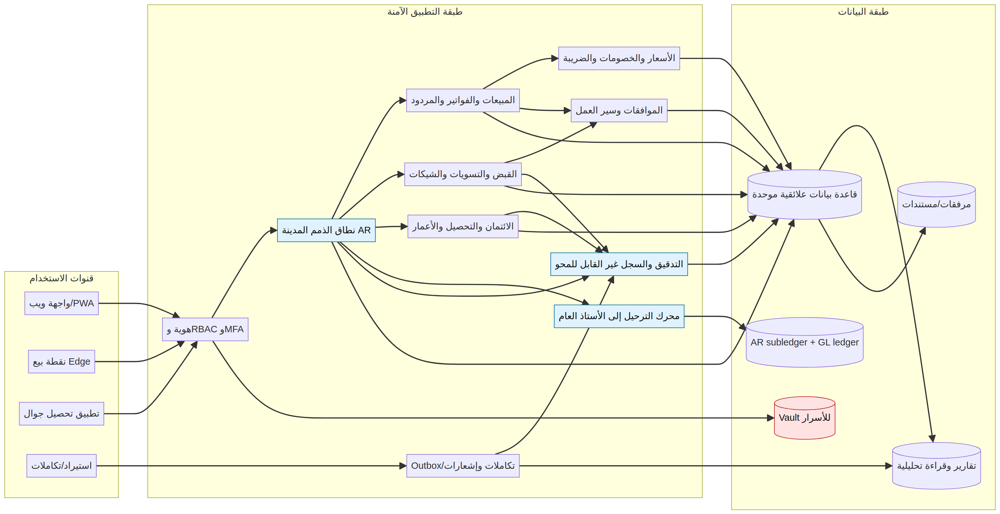

# تقرير تحليل نظام Onyx Pro/ERP ونطاق الذمم المدينة AR

**إعداد:** Manus AI  
**تاريخ التقرير:** 11 سبتمبر 2026  
**مصدر التحليل:** الأرشيف المرفق `مجلد١.zip`

## 1. الخلاصة التنفيذية

الأرشيف لا يحتوي على نظام AR مستقلًا بالمعنى الضيق. بل يحتوي على أجزاء مترابطة من نظام ERP قديم مبني على Oracle Forms، وتغطي هذه الأجزاء المحاسبة العامة، الذمم المدينة، الذمم الدائنة، المبيعات، المشتريات، المخازن، نقطة البيع، إقفال الفترات، إدارة الفروع، المستخدمين، التقارير، ومزامنة قواعد بيانات الفروع. يثبت ذلك انتشار أسماء الجداول والإجراءات الخاصة بالفواتير، المقبوضات، القيود، المخزون، نقاط البيع، العملاء، الموردين، والفروع داخل ملفات FMX [1] [3].

النتيجة الأهم هي أن ملفات FMX المرفقة **ملفات تشغيلية مجمّعة** وليست ملفات مصدر. لذلك يمكن إثبات أسماء الوحدات، بعض الدوال، أسماء الجداول، استعلامات SQL المضمنة، أوامر DDL/DML الظاهرة كسلاسل نصية، المكتبات المرتبطة، ورسائل الأخطاء. ولا يمكن من هذه الملفات وحدها إثبات كل Trigger أو كل مسار تنفيذي أو كل خاصية مرئية أو كل نوع بيانات فعلي في قاعدة البيانات. إعادة بناء «كل code» بدقة تتطلب ملفات FMB وPLL/PLX ومصادر PL/SQL وتفريغ مخطط قاعدة البيانات.

التصميم المقترح هو **منصة AR حديثة ذات دفتر أستاذ فرعي مستقل**، تتكامل مع المبيعات ونقطة البيع والأستاذ العام والمخزون، وتفرض أن تكون المستندات المرحلة غير قابلة للتعديل. أي تصحيح بعد الترحيل يجب أن يتم بمستند عكسي أو إشعار مدين/دائن، لا بتعديل مباشر لصفوف القيود أو بتفعيل أعلام عامة تسمح بالتعديل والحذف. ويوصى بفصل واجهة المستخدم عن صلاحيات قاعدة البيانات، وإضافة سجل تدقيق غير قابل للمحو، ومخزن أسرار، وطابور تكامل idempotent، وضبط متعدد الشركات والفروع والفترات.

## 2. حدود الأدلة والمنهجية

تم فك الأرشيف دون تعديل الملفات الأصلية، وفحص نوع كل ملف وحجمه وتاريخه وبصمته SHA-256، واستخراج السلاسل ASCII وUTF-16LE، والبحث عن مؤشرات `PKG INIT`، وأسماء الإجراءات، وعبارات SQL/DDL/DML، وأسماء الجداول والكائنات، ومؤشرات الصلاحيات والأسرار. كما تم فحص ملف PDF مرئيًا صفحة صفحة، لأن استخراج النص العربي منه متأثر بترميز الخط المضمّن [2] [4].

تعبير «عدد SQL» في هذا التقرير يعني عدد المقاطع النصية التي تطابق كلمات SQL داخل الملف الثنائي. وهو **مؤشر جرد** وليس عددًا دقيقًا للاستدعاءات التنفيذية، لأن العبارة قد تكون مكررة أو مقطوعة أو جزءًا من نص أطول. وبالمثل، فإن عدد الجداول المرشحة يتضمن أحيانًا كلمات التقطها المحلل من DDL أو أسماء أعمدة؛ لذلك استخدمت عبارة «مرجع مرشح» حين لا يكون التحقق من مخطط قاعدة البيانات ممكنًا.

توجد قيود مهمة على الاستنتاج. لم يتم تشغيل أي FMX، ولم يتم الاتصال بأي قاعدة بيانات، ولم يتم تنفيذ أي DDL أو DML، ولم يتم اختبار تسجيل الدخول أو المزامنة أو الإقفال. ولذلك لا يمثل هذا التقرير شهادة قبول وظيفي أو أمني للنظام الحالي.

## 3. جرد الأرشيف

الأرشيف يضم ثمانية ملفات: سبعة FMX وملف PDF واحد. إجمالي الحجم غير المضغوط هو 30,614,668 بايت. توضح الأرقام التالية الفرق بين حجم الوحدة، كثافة النص القابل للاستخراج، وطبيعة الدور المستنتج.

| الملف | النوع والحجم | التاريخ الظاهر في الأرشيف | السلاسل الفريدة التقريبية | SQL المرئي | الدور المستنتج |
|---|---:|---|---:|---:|---|
| `POSLGN.fmx` | FMX، 19,452,264 بايت | 2016-12-14 | 1,918 | 70 | الدخول، الجلسة، الطرفية، الشجرة الرئيسية، الصلاحيات، استدعاء الشاشات |
| `IASADMT022.fmx` | FMX، 5,763,620 بايت | 2016-03-02 | 58,317 | 5,587 | إدارة وتهيئة النظام، الإقفال، الفروع، ترحيل البيانات، سكربتات الكائنات، POS |
| `ADMT0222.fmx` | FMX، 1,004,156 بايت | 2019-01-02 | 4,473 | 621 | نسخة إدارية/تهيئة مرتبطة بمكتبات `NSPC1` |
| `ADMT022.fmx` | FMX، 933,032 بايت | 2017-02-09 | 4,012 | 593 | نسخة إدارية/تهيئة مرتبطة بمكتبات `NSPC2` |
| `IASInstall_Pos.fmx` | FMX، 272,984 بايت | 2016-03-02 | 1,317 | 137 | تركيب POS وإنشاء الروابط والمزامنة والأرشفة |
| `OPEN_PASS_YSERP.fmx` | FMX، 52,336 بايت | 2010-09-05 | 206 | 3 | فتح/فحص كلمة المرور والتحقق من مستخدم النظام |
| `ACTIVE_UNPOSTING.fmx` | FMX، 15,460 بايت | 2010-01-03 | 52 | 3 | تفعيل أعلام التعديل والحذف وإلغاء الترحيل |
| `OnyxPro_System.pdf` | PDF، 3,120,816 بايت، 26 صفحة | إنشاء PDF: 2008-12-01 | — | — | كتيب وظائف إصدار 2.1/2009 |

ملف PDF قديم زمنيًا مقارنة بالـFMX. فهو يوثق إصدارًا تسويقيًا/وظيفيًا من 2009، بينما تظهر داخل FMX إصدارات ونوافذ مؤرخة بين 2010 و2019. لذلك يستخدم الكتيب لتحديد نطاق الأعمال التاريخي، ولا يستخدم كمواصفة نهائية للسلوك الحالي.

## 4. قراءة وثيقة PDF والوظائف التجارية

يوثق الكتيب نظامًا أوسع من AR. في إدارة الحسابات تظهر وظائف تعدد العملات، تسويات البنوك، التفقيط، شجرة الدليل، مراكز التكلفة، العملاء والموردين، الضمانات، صلاحيات الشاشة، تسجيل آخر إدخال وتعديل، وسجل حركة المستخدم [2] [4]. هذه الوظائف تتوافق جزئيًا مع أسماء الجداول والإجراءات الظاهرة في `IASADMT022.fmx` وملفات الإدارة.

في المبيعات والعملاء يذكر الكتيب التسعير، قائمة العملاء السوداء، سجل آخر عشر حركات للصنف والعميل، الخصومات، الكميات المجانية، العمولات، شروط التحصيل، حدود الائتمان، المردود، عروض الأسعار، الصلاحيات، وإظهار السعر في مردود المبيعات. هذه ليست وظائف عرض فقط؛ بل هي مدخلات تؤثر في رصيد العميل وفي قيد المبيعات والضريبة والمخزون.

في المشتريات والموردين يظهر سير عمل لطلب الشراء وأمر الشراء والتحويل، اعتماد الأوامر، ربط المورد بالصنف، آخر حركات الشراء، الخصومات، التسويات، أنواع أوامر الشراء، وتصنيف الطلبات الداخلية والخارجية. وفي المخازن يظهر دعم VAT، الحركة المخزنية، التسعير، الحد الأدنى والأعلى، الجرد، ترتيب الأصناف، طلبات الصرف والتحويل، والمجموعات الفرعية للأصناف.

| النطاق التجاري | الأدلة المرئية في PDF | مؤشرات FMX المتوافقة |
|---|---|---|
| الأستاذ العام GL | الدليل، الفترات، القيود، مراكز التكلفة، العملات | `ACCOUNT`, `ACCOUNT_CURR`, `OPEN_BAL`, `IAS_POST_MST`, `IAS_POST_DTL`, `VOUCHERS`, `VOUCHER_DETAIL` |
| الذمم المدينة AR | العملاء، الحدود، الأقساط، التحصيل، المردود، العمولات | `CUSTOMER`, `CUSTOMER_CURR`, `IAS_PARA_AR`, `IAS_INSTALLMENT`, `IAS_PRIV_AR`, `IAS_BILL_MST`, `IAS_RT_BILL_MST` |
| الذمم الدائنة AP | الموردون، أوامر الشراء، المردود، الشيكات | `V_DETAILS`, `IAS_PARA_AP`, `IAS_PI_BILL_MST`, `IAS_PR_BILL_MST`, `P_ORDER`, `P_REQUEST`, `VOUCHERS` |
| المخزون | الأصناف، المخازن، الحركة، الأسعار، الجرد، التكلفة | `ITEM_DETAILS`, `IAS_ITM_MST`, `IAS_ITM_DTL`, `STORAGE`, `ITEM_MOVEMENT`, `WAREHOUSE_DETAILS`, `IAS_ITEM_PRICE` |
| المبيعات | الفواتير، المردود، الخصم، الكميات المجانية، التسعير | `IAS_BILL_MST/DTL`, `IAS_RT_BILL_MST/DTL`, `SALES_DISC`, `SALES_FREE_QTY`, `SALES_ORDER` |
| نقطة البيع | الفواتير، المردود، النقد، الأجهزة، التاريخ، المزامنة | `IAS_POS_BILL_MST/DTL`, `IAS_POS_RT_BILL_MST/DTL`, `IAS_POS_PAY_CASH`, `IAS_POS_MACHINE`, جداول التاريخ |
| الإدارة والأمن | المستخدم، الطرفية، الفرع، شجرة النظام، الصلاحيات | `USER_R`, `S_BRN`, `S_BRN_USR_PRIV`, `FORM_DETAIL`, `IAS_FORM_NAME`, `PRIVILEGE`, `IAS_SYS.S_TRMNLS` |

## 5. تحليل كل وحدة FMX

### 5.1 `POSLGN.fmx`: نقطة الدخول والأمن التشغيلي

هذا هو أكبر ملف FMX في الأرشيف. يحتوي على 42 قسمًا مسمى حول مؤشرات `PKG INIT`، و28 مكتبة/مسارًا نصيًا، و70 مقطع SQL مرئيًا. تظهر فيه إجراءات الدخول والتحقق مثل `VALIDATE_PASS`, `DECRYPT_PASS`, `CHECK_USER_TRMNAL`, `CHECK_DB_BRANCH`, `CHECK_LANG`, و`GET_TERMINAL_DFLT`. كما تظهر إجراءات الواجهة مثل `LOAD_TREE`, `EXPAND`, `COLLAPSE`, `CALL_SCR`, `CALL_FAV_SCR`, `RUNPRG`, و`FIND_IN_TREE_PRC`.

يعتمد الدخول على `USER_R` وحالة `LOGGED_ON` والطرفية والفرع والسنة واللغة. توجد إشارات إلى `V$SESSION`, `DBMS_SESSION`, و`CLIENT_IDENTIFIER`, وإلى تسجيل تاريخ الدخول في `IAS_USR_LGN_HSTRY`. يظهر أيضًا تحديث مباشر لحالة المستخدم عند الخروج، والتحقق من عدم تعدد الجلسات أو ربط الجلسة بطرفية معينة. هذه الوظائف مفيدة تجاريًا، لكنها تجعل النظام شديد الاعتماد على Oracle وWindows والطرفية.

توجد مؤشرات أمنية عالية الحساسية: قراءة حقل `PASSWORD` من `USER_R`, دالة باسم `DECRYPT_PASS`, مكوّن OLE/COM باسم `SECU_YSSEC`, تحميل DLL باسم `YsErpSYs.dll`, قراءة ملف serial من `SYSTEM32`, واستدعاءات `ALTER SYSTEM KILL SESSION` أو `DISCONNECT SESSION`. يجب استبدال هذه الآليات بهوية مركزية، وتجزئة كلمات المرور، وإدارة جلسات على مستوى الخدمة، وعدم منح واجهة المستخدم قدرة قتل جلسات قاعدة البيانات.

### 5.2 `IASADMT022.fmx`: مركز التهيئة والترحيل والإقفال

هذا الملف هو الأثقل من حيث المحتوى النصي: 58,317 سلسلة فريدة تقريبًا و5,587 مقطع SQL مرئيًا و67 قسمًا وظيفيًا مسمى. تظهر فيه إجراءات الإقفال مثل `PL_CLOSING_PRC`, `CHK_CLOSE_PKG_PRC`, `ACTIVE`, وإنشاء عروض السنة الجديدة. وتظهر إجراءات نقل البيانات مثل `MOVE_DATA_PRC`, `MOVE_BILLS_PRC`, `MOVE_CHEQUE_PRC`, `MOVE_LC`, `MOVE_KIM_AP_PRC`, `MOVE_OUT_REQ_PRC`, `MOVE_GR_INCOMING_PRC`, `MOVE_SALES_ORDERS_PRC`, `MOVE_PURCHASE_REQ_PRC`, و`MOVE_PURCHASE_ORDER_PRC`.

يحتوي أيضًا على عائلة واسعة من إجراءات الإدارة والـDDL، مثل `CREATE_BRANCH_PRC`, `CREATE_JOB_PROC`, `CREATE_MV_LOG_PRC`, `DBA_TABLE_SCRIPT`, `DBA_PACKAGE_SCRIPT*`, `DBA_PROCEDURE_SCRIPT`, `DBA_TRIGGER_SCRIPT`, `DBA_VIEW_SCRIPT`, `DBA_FUNCTION_SCRIPT`, و`DBA_SYNONYMS`. وجود هذه الإجراءات داخل FMX يعني أن برنامجًا تشغيليًا يمكنه إنشاء أو حذف أو تعديل كائنات قاعدة البيانات، وليس مجرد قراءة البيانات.

الوظائف المحاسبية الأكثر أهمية هي `INSERT_POST_TABLES` و`REC_TRANSFER_NOT_REC_PRC` و`PL_CLOSING_PRC`. تظهر جداول الترحيل `IAS_POST_MST` و`IAS_POST_DTL`, جداول القيود `VOUCHERS` و`VOUCHER_DETAIL`, جداول الفترات `MASTER_PERIODS` و`DETAIL_PERIODS`, وجداول الأرصدة `OPEN_BAL` و`ACCOUNT_CURR`. كما تظهر جداول المخزون والحركة والفواتير والمردود، ما يثبت أن الإقفال لا يخص AR وحده بل يغيّر حالة النظام ككل.

### 5.3 `ADMT022.fmx` و`ADMT0222.fmx`: وحدتان إداريتان متشابهتان وليستا نسخة واحدة

كل ملف يحتوي على 63 قسمًا وظيفيًا مسمى تقريبًا. كلاهما يتضمن وظائف الشاشة العامة `ADD_PROC`, `SAVE_PROC`, `DELETE_PROC`, `LIST_PROC`, `KEY_ENTQRY`, `KEY_EXEQRY`, `PRINT_PROC`, `PRE_FORM_PRC`, `POST_FORMS_COMMIT_PRC`, والتحقق والإقفال ونقل البيانات. لكنهما ليسا متطابقين؛ تشابه تسلسل السلاسل النصية المحسوب هو 0.524 فقط، مع 1,791 سطر حذف و2,252 سطر إضافة في المقارنة النصية التقريبية [3].

الفرق الأوضح هو أن `ADMT022.fmx` يعتمد على مسارات `NSPC2`، بينما `ADMT0222.fmx` يعتمد على `NSPC1`. تظهر في النسخة الثانية مكتبة `SECURITY_PKG` وبعض إجراءات مقارنة الجداول والأعمدة وإنشاء synonyms وأنظمة إضافية، كما تظهر كائنات أحدث مثل `S_EMP`, `IAS_COLLECTION_PLAN_MST`, `IAS_CPN_*`, `IAS_PARA_ONLINE`, و`IAS_MNDTRY_SCR_FIELDS`. لذلك يجب اعتبارهما **فرعين/نسختين مختلفتين**، وعدم دمجهما أو استبدال أحدهما بالآخر دون مصفوفة توافق بين مكتبات Forms وPL/SQL ومخطط قاعدة البيانات.

### 5.4 `IASInstall_Pos.fmx`: تركيب ومزامنة POS

يحتوي الملف على ثمانية أقسام مسماة: `DYNAMIC_LIST`, `DROP_CONSTRAINTS`, `CREATE_JOB_PROC`, `GET_CONS_NAME`, `SYNCHRONIZE_DATA_SALES_PROC`, `SYNCHRONIZE_DATA_TRANSFER_PROC`, `IAS_GET_ALL_FLD_TBL_FNC`, و`CREATE_DB_LINK`. تظهر داخله جداول الفواتير المؤقتة والتاريخية، مثل `IAS_POS_BILL_TEMP`, `IAS_POS_RT_BILL_TEMP`, `IAS_POS_HST_BILL_MST`, `IAS_POS_HST_RT_BILL_MST`, وجداول الدفع النقدي.

منطق المزامنة المستنتج هو نقل الفواتير غير المرحلة إلى جدول مؤقت، استدعاء إجراءات POS لإدخالها أو ترحيلها، نسخ الفواتير المرحلة إلى جداول التاريخ، حذفها من الجداول التشغيلية، تحديث أرقام الأجهزة، وتحريك بيانات مردود المبيعات وبطاقات الدفع. يظهر ذلك من عبارات `INSERT ... SELECT`, `DELETE`, `COMMIT`, و`RAISE_APPLICATION_ERROR` ذات الأكواد من -20001 إلى -20012. هذا التصميم يحتاج في البديل إلى سجل outbox، وحالة مزامنة لكل مستند، ومفتاح idempotency، بدل النقل بالحذف بين قواعد البيانات.

الملف ينشئ أيضًا database links عامة ويستخدم بيانات اعتماد إدارية ظاهرة كنص قابل للاستخراج. يجب اعتبار ذلك حادثة أسرار محتملة: تدوير بيانات الاعتماد، إزالة الروابط العامة، استخدام حساب خدمة محدود، وتطبيق TLS وallow-list واتصال صادر مضبوط.

### 5.5 `OPEN_PASS_YSERP.fmx`: مسار كلمات المرور

يحتوي الملف على أربع دوال مسماة: `GET_PTH`, `GET_X_Y_POS`, `GET_N`, و`DECRYPT_PASS`. تظهر استعلامات إلى `USER_R.PASSWORD` والتحقق من وجود مستخدم Oracle باسم مركب من `IAS` ورقم المستخدم. وجود ملف مستقل لهذا الغرض، مع دالة فك تشفير وكلمة مرور نظامية قابلة للاستخراج من binary strings، يمثل خطرًا حرجًا في أي بيئة حقيقية.

البديل المقترح هو عدم تخزين كلمة المرور القابلة للعكس، وعدم إعادة كلمة المرور إلى Forms أو العميل. يجب استخدام Argon2id أو bcrypt لكلمات مرور المستخدمين، وVault للأسرار التشغيلية، وOIDC/SAML أو خدمة هوية مركزية، وتسجيل محاولات الدخول والرفض وتدوير مفاتيح التشفير.

### 5.6 `ACTIVE_UNPOSTING.fmx`: تفعيل تعديل وحذف المستندات

يحتوي الملف على ثلاث عبارات SQL مرئية تقريبًا، منها تحديث أعلام `USE_MOD_AP`, `USE_DEL_AP`, `USE_MOD_AR`, `USE_DEL_AR`, `USE_MOD_GL`, `USE_DEL_GL`, `USE_MOD_INV`, `USE_DEL_INV`, و`USE_UNPOSTING`. كما تظهر إشارات إلى تحديث حالة شاشة في `FORM_DETAIL` وإلى كائن نظام في `IAS_SYS.S_SYSTEM`.

هذه الوحدة تجعل سلوك النظام قابلًا لتغيير مركزي واسع بمجرد تفعيل الأعلام. في نظام محاسبي حديث يجب أن تكون صلاحية التعديل بعد الترحيل سياسة دقيقة حسب نوع المستند والفترة والدور، وأن يتم التصحيح بقيود عكسية وإشعارات دائن/مدين مع سبب وموافقة وسجل تدقيق. لا ينبغي أن يوجد مفتاح عام يفتح تعديل أو حذف AP وAR وGL والمخزون معًا.

## 6. جرد الوظائف والدوال

تم العثور على 247 قسمًا وظيفيًا مسمى حول مؤشرات `PKG INIT` في ستة ملفات FMX؛ لا يظهر قسم مسمى بالطريقة نفسها في `ACTIVE_UNPOSTING`. التوزيع هو 63 في `ADMT022`, و63 في `ADMT0222`, و67 في `IASADMT022`, و8 في `IASInstall_Pos`, و4 في `OPEN_PASS_YSERP`, و42 في `POSLGN` [5].

| التصنيف المستنتج | عدد الأقسام | الوظائف النموذجية |
|---|---:|---|
| ترحيل، ترصيد، إقفال، مزامنة | 46 | `MOVE_DATA_PRC`, `PL_CLOSING_PRC`, `MOVE_CHEQUE_PRC`, `SYNCHRONIZE_DATA_SALES_PROC` |
| تهيئة وترحيل وDDL | 52 | `CREATE_BRANCH_PRC`, `DBA_TABLE_SCRIPT`, `CREATE_MV_LOG_PRC`, `DROP_CONSTRAINTS` |
| تحقق وسلامة بيانات وترقيم | 36 | `CHECK_DATA_PRC`, `CHECK_PARAMETERS_PRC`, `CHECK_DUPLICATE`, `GET_SERIAL_REC` |
| تشغيل شاشة وCRUD وتقارير | 29 | `ADD_PROC`, `SAVE_PROC`, `DELETE_PROC`, `PRINT_PROC`, `CALL_SCR_PRINT` |
| خدمة وإعداد ومساعدة | 25 | `LOAD_PARAMETERS`, `GET_PROMPT`, `SEND_MSG`, `RUN_TIMER` |
| واجهة وتنقل وتكامل عميل | 12 | `LOAD_TREE`, `EXPAND`, `COLLAPSE`, `RESIZE_WINDOWS`, `RUNPRG` |
| أمن ودخول وجلسة | 10 | `VALIDATE_PASS`, `CHECK_USER_TRMNAL`, `DECRYPT_PASS`, `ACTIVE_CODE_PRC` |
| عام أو غير محسوم من binary strings | 37 | أقسام لا يكفي اسمها وحده لتحديد الغرض |

يوجد كتالوج تفصيلي وظيفة-بوظيفة في ملف `routine_catalog_sanitized.md`. يتضمن لكل قسم نقطة البداية والنهاية في ملف السلاسل، التصنيف المستنتج، الجداول المرشحة، عينات SQL، ومؤشرات المخاطر. هذا هو أقرب مستوى يمكن تحقيقه من تحليل الدوال اعتمادًا على FMX فقط، مع إبقاء كل استنتاج موسومًا بأنه مستنتج لا مثبت من المصدر.

## 7. تحليل البيانات والعلاقات الوظيفية

### 7.1 طبقة التنظيم والمستخدم

تظهر `USER_R` كمصدر للمستخدم واللغة والفرع والاتصال وحالة تسجيل الدخول، وتظهر `S_BRN` و`S_CMPNY` و`S_BRN_USR_PRIV` لتنظيم الشركات والفروع وصلاحيات المستخدم. وتظهر `IAS_SYS.S_TRMNLS` و`IAS_SYS.S_TRMNLS_AUTHRTY` وربطها بـ`V$SESSION` لفرض قيود الطرفية والخادم.

### 7.2 طبقة الزمن المحاسبي

تظهر `MASTER_PERIODS`, `DETAIL_PERIODS`, و`S_PRD_MST/S_PRD_DTL` للتحكم في السنة والفترات والشهر وحالة إقفال المخزون والربح والخسارة والحسابات. وجود أعلام مثل `PL_CLOSE`, `Y_CLOSE`, و`INV_CLOSE` يوضح أن الإقفال متعدد المجالات، وأن فتح فترة مغلقة يجب أن يكون عملية محكومة ومراجعة.

### 7.3 طبقة الأستاذ العام

تظهر `ACCOUNT`, `ACCOUNT_CURR`, `OPEN_BAL`, `IAS_POST_MST`, `IAS_POST_DTL`, `VOUCHERS`, و`VOUCHER_DETAIL`. هذه المجموعة توحي بوجود فصل بين رأس القيد وتفاصيله، وأرصدة افتتاحية أو جارية، وقسائم قبض/صرف، وربط بمراكز التكلفة والمشاريع والعملات. أي تصميم AR يجب أن ينشئ قيدًا متوازنًا في هذه الطبقة، لكن لا ينبغي أن يعتمد على إعادة حساب رصيد العميل عبر تحديث مباشر لصف واحد.

### 7.4 طبقة AR

تظهر أسماء العملاء والعملات والحدود والصلاحيات والجدولة مثل `CUSTOMER`, `CUSTOMER_CURR`, `IAS_PRIV_CUSTOMER`, `IAS_CUSTOMER_CC_LMT`, `IAS_PARA_AR`, `IAS_INSTALLMENT`, و`IAS_INSTALLMENT_PI`. وتظهر جداول المبيعات والمردود والفواتير مثل `IAS_BILL_MST`, `IAS_BILL_DTL`, `IAS_RT_BILL_MST`, و`IAS_RT_BILL_DTL`. الاستنتاج المعقول هو أن رصيد العميل يتأثر بالفاتورة والمردود والقبض والقيود والعملة والفترة.

### 7.5 طبقة AP والمشتريات

تظهر `V_DETAILS`, `VENDOR_GROUP`, `VENDOR_CURR`, `IAS_PRIV_VENDOR`, `IAS_PI_BILL_MST/DTL`, `IAS_PR_BILL_MST/DTL`, `P_ORDER`, `P_REQUEST`, و`GR_NOTE/GR_DETAIL`. هذه الطبقة تقابل AR من جهة الموردين وتدخل في قيود المخزون والمصروف والضريبة والحسابات الدائنة.

### 7.6 طبقة المخزون والتكلفة

تظهر `ITEM_DETAILS` أو `IAS_ITM_MST`, تفاصيل الوحدات والأحجام والباركود، `WAREHOUSE_DETAILS`, `STORAGE` أو `IAS_ITM_WCODE`, `ITEM_MOVEMENT`, `IAS_OPEN_STOCK`, `IAS_ITEM_PRICE`, `ITEMS_COSTING`, و`SALES_DISC/SALES_FREE_QTY`. كما تظهر إشارات إلى weighted average والتكلفة قبل/بعد الحركة. لذلك لا ينبغي فصل AR عن حركة المخزون في فواتير البيع الآجلة، لأن المستند الواحد يولد أثرًا ماليًا ومخزنيًا.

### 7.7 طبقة POS والتكامل

تظهر جداول نقاط البيع التشغيلية والتاريخية وأرقام الأجهزة والمردود والنقد. وتظهر materialized views وdatabase links وscheduler jobs لمزامنة الفروع. هذه البنية توضح أن النظام موزع جزئيًا، لكن آلية المزامنة الحالية أقرب إلى نقل جماعي وإعادة إنشاء كائنات منها إلى تكامل قابل للتتبع.

## 8. تقييم الأمن والحوكمة

نتائج الجرد الآلي العام تعطي مؤشرات تقريبية على 47 ظهورًا لمؤشرات سر أو كلمة مرور، و53 ظهورًا لصلاحيات واسعة، و210 ظهورًا لعبارات حذف أو DDL هدّام، و29 ظهورًا للتحكم بالنظام أو الجلسات، و288 ظهورًا لـSQL ديناميكي، و166 ظهورًا للتعديل المباشر أو الإلغاء، و12 ظهورًا لاعتماديات Windows/العتاد، و7 ظهورًا لمعالجة أخطاء ضعيفة. هذه الأرقام لا تعني عدد الثغرات، لأن النص قد يتكرر أو يظهر في سياق تثبيت مقصود، لكنها تحدد بؤر التدقيق [3] [6].

| الدرجة | الملاحظة | الأثر المحتمل | المعالجة الإلزامية |
|---|---|---|---|
| حرجة | كلمات مرور أو أسماء أسرار قابلة للاستخراج من FMX، واستعلامات إلى `USER_R.PASSWORD` | اختراق حسابات المستخدم أو قاعدة البيانات | تدوير كل الأسرار، حذفها من المصدر والـFMX، Vault، تجزئة كلمات المرور، منع القراءة المباشرة |
| حرجة | `GRANT DBA`, `ANY TABLE`, `ANY PROCEDURE`, `CREATE PUBLIC DATABASE LINK`, `DROP USER` | سيطرة كاملة أو حذف واسع للبيانات | حسابات خدمة محدودة، migrations موقعة، فصل التثبيت عن التشغيل، موافقات ثنائية |
| عالية | `ALTER SYSTEM KILL/DISCONNECT SESSION` من مسار الدخول | تعطيل جلسات أو إساءة استخدام الصلاحية | خدمة DBA منفصلة، policy engine، منعها من العميل |
| عالية | تفعيل `USE_MOD_*`, `USE_DEL_*`, `USE_UNPOSTING` | تعديل أو حذف مستندات مرحلة وفقد الأثر المحاسبي | مستندات عكسية، workflow، منع UPDATE للمستند المرحل |
| عالية | إنشاء وحذف materialized views وقيود وجداول من واجهة | تلف المخطط أو توقف النظام | pipeline إدارة مخطط منفصل، dry-run، نسخ احتياطي، migration lock |
| متوسطة | `WHEN OTHERS THEN NULL` في إجراءات التثبيت والمزامنة | نجاح ظاهري مع بيانات ناقصة | أخطاء structured، rollback ذري، جدول dead-letter، تنبيه فوري |
| متوسطة | ملفات DLL وserial و`SYSTEM32` وOLE/FFI | عدم قابلية النقل وصعوبة المراقبة | استبدال بالمتصفح/خدمة أجهزة معزولة، سياسات توقيع، telemetry |

ينبغي عدم تشغيل ملفات التثبيت أو المزامنة على قاعدة إنتاج قبل عزلها في نسخة اختبار، ومراجعة كل عبارة DDL وGRANT وdatabase link. كما يجب إخطار مالك النظام بأن وجود أسرار قابلة للاستخراج يعني أن تدوير بيانات الاعتماد يجب أن يسبق أي نشر أو مشاركة جديدة للملفات.

## 9. التصميم المستهدف لنظام AR موسع

### 9.1 المبادئ

المبدأ الأول هو فصل دفتر AR الفرعي عن واجهة المستخدم. تسجل خدمة AR المستند، وتتحقق من الشركة والفرع والفترة والعملة والحد الائتماني، ثم تنشئ الجدول الزمني للاستحقاقات وقيد الأستاذ العام عبر محرك ترحيل واحد.

المبدأ الثاني هو عدم تعديل المستند المرحل. الفاتورة المرحلة لا تعدل صفوفها ولا رصيد العميل مباشرة. الإرجاع يصدر إشعارًا دائنًا، والزيادة تصدر إشعارًا مدينًا، وتصحيح القيد يصدر عكسًا مرتبطًا بالمصدر.

المبدأ الثالث هو أن كل عملية تكامل قابلة لإعادة المحاولة بأمان. يملك كل مستند `source_system`, `source_id`, و`idempotency_key`. إذا أعيد إرسال فاتورة POS، لا تنشأ فاتورة ثانية.

المبدأ الرابع هو أن الأمن يعتمد على الدور والنطاق. يستطيع المستخدم رؤية فروع أو عملاء أو أنواع مستندات محددة، ولا يحصل التطبيق على `DBA` أو `ANY TABLE`. تسجل كل عملية إنشاء واعتماد وترحيل وتعديل مرفوض وموافقة في سجل تدقيق.

### 9.2 المكونات

| المكون | المسؤولية |
|---|---|
| الهوية وRBAC | تسجيل الدخول، MFA، الأدوار، نطاق الشركة/الفرع، الجلسة، السياسات |
| البيانات الأساسية | الشركات، الفروع، العملات، العملاء، شروط السداد، الضرائب، الحسابات، مراكز التكلفة |
| AR | الفواتير، الإشعارات، جدول الاستحقاق، رصيد العميل، العملات، التسويات |
| الائتمان والتحصيل | حد الائتمان، الإيقاف، الأعمار، وعود السداد، خطط التحصيل، النزاعات |
| القبض | إيصالات نقدية/بنك/شيك/بطاقة، التوزيع على الاستحقاقات، التسوية البنكية |
| المبيعات وPOS | الفاتورة، المردود، الخصم، الضريبة، الدفع، الإرسال إلى AR |
| محرك الترحيل | توليد قيد متوازن، منع الترحيل لفترة مغلقة، reversal، ربط المصدر |
| سير العمل | طلب، اعتماد، رفض، اعتماد ائتماني، اعتماد خصم، اعتماد إلغاء |
| التكامل | API، outbox، استيراد، مزامنة POS والفروع، مراقبة الفشل |
| التدقيق والتقارير | سجل غير قابل للمحو، aging، كشف الحساب، دفتر اليومية، reconciliation |

### 9.3 تدفقات العمل

**إنشاء الفاتورة:** ينشئ المستخدم مسودة، يختار العميل والعملة وشروط السداد، تدخل خدمة الأسعار الخصم والضريبة، يتحقق محرك الائتمان من الحد، يرسل المستند إلى الاعتماد عند الحاجة، ثم ينفذ الترحيل. ينتج الترحيل جدول استحقاق واحدًا أو أكثر، وقيدًا مدينًا على حساب العميل ودائنًا على الإيراد والضريبة، مع أثر مخزني إذا كانت الفاتورة صنفًا.

**القبض:** ينشئ المستخدم إيصالًا، يحدد وسيلة الدفع، يوزع المبلغ على فواتير أو استحقاقات، ويثبت النظام allocation مستقلًا. بعد الاعتماد، يولد المحرك قيدًا مدينًا للصندوق/البنك ودائنًا للعميل. لا يسمح النظام بتوزيع يتجاوز الرصيد المفتوح.

**الإشعار الدائن:** ينشأ كوثيقة مرتبطة بالفاتورة الأصلية، ويخفض الاستحقاق أو ينشئ رصيدًا دائنًا بحسب السياسة. لا تحذف الفاتورة الأصلية ولا يعاد فتحها بصمت.

**التسوية:** تستورد حركة البنك، تطابق المبلغ والتاريخ والمرجع، تضع المطابقة في حالة مقترحة، ثم تعتمدها، مع الاحتفاظ بالحالات غير المطابقة في قائمة استثناءات.

**مزامنة POS:** تسجل نقطة البيع الحدث محليًا مع مفتاح idempotency، ترسله إلى outbox، تستقبله خدمة التكامل، تتحقق من الفرع والآلة والرقم التسلسلي، تنشئ المستند أو تعيد نتيجة المستند السابق، ثم ترسل حالة القبول أو الرفض إلى POS.

## 10. مخطط قاعدة البيانات المقترح

يقدم الملف `ar_target_schema.sql` مخططًا مرجعيًا لنواة AR. الجداول الرئيسية هي `ar_customer`, `ar_doc`, `ar_doc_line`, `ar_due_schedule`, `ar_receipt_allocation`, `gl_journal`, `gl_journal_line`, `audit_event`, و`outbox_event`. المخطط يفرض مفاتيح فريدة للمستند ومصدره، ويربط المستند بالشركة والفرع والفترة والعميل، ويخزن العملة وسعر الصرف، ويفصل جدول الاستحقاقات عن رأس الفاتورة.

المخطط المرجعي مكتوب بصيغة PostgreSQL التصميمية، ويمكن تحويله إلى Oracle إذا تقرر الإبقاء على Oracle. أثناء التحويل يجب استبدال `generated always as identity` و`jsonb` و`inet` بما يناسب نسخة Oracle، مع المحافظة على القيود المنطقية نفسها. الأهم ليس نوع SQL، بل invariants: توازن القيد، عدم تجاوز التخصيص للرصيد، فريدة المصدر، وعدم تعديل المستند المرحل.

## 11. واجهات الخدمة المقترحة

| المسار | العملية | الضوابط |
|---|---|---|
| `POST /api/v1/ar/invoices` | إنشاء مسودة فاتورة | idempotency، العميل نشط، العملة، الضريبة |
| `POST /api/v1/ar/invoices/{id}/submit` | إرسال للاعتماد | صلاحية الدور، اكتمال الحقول |
| `POST /api/v1/ar/invoices/{id}/post` | ترحيل الفاتورة | الفترة مفتوحة، حد ائتماني، قيد متوازن |
| `POST /api/v1/ar/receipts` | إنشاء إيصال | وسيلة قبض، عملة، رقم مرجعي فريد |
| `POST /api/v1/ar/receipts/{id}/allocate` | توزيع قبض | لا يتجاوز الرصيد، لا يخلط شركة أو فرعًا بلا سياسة |
| `POST /api/v1/ar/credit-notes` | إشعار دائن | مرجع أصل، سبب، موافقة عند الحاجة |
| `GET /api/v1/ar/customers/{id}/statement` | كشف حساب | نطاق المستخدم، cutoff date، pagination |
| `GET /api/v1/ar/customers/{id}/aging` | أعمار الديون | تاريخ تقييم، قواعد الاستحقاق، العملة |
| `POST /api/v1/integrations/pos/events` | استقبال POS | توقيع، idempotency، outbox، dead-letter |
| `GET /api/v1/audit/events` | سجل التدقيق | صلاحية تدقيق فقط، لا حذف من API |

## 12. خطة الترحيل من النظام الحالي

تبدأ المرحلة الأولى بنسخة قراءة فقط من قاعدة البيانات الحالية، واستخراج مخطط الجداول والفهارس والقيود والمشغلات والحزم والصلاحيات. لا تستخدم ملفات FMX كبديل عن المصدر. بعدها تنشأ مصفوفة mapping بين `USER_R`, `CUSTOMER`, `ACCOUNT`, `IAS_BILL_MST/DTL`, `VOUCHERS/VOUCHER_DETAIL`, جداول POS، والجداول الجديدة.

في المرحلة الثانية تنظف البيانات الأساسية: تكرار العملاء، العملاء غير المرتبطين بحسابات، العملات وأسعار الصرف، الفروع، الفترات، الضرائب، الحسابات، والأرقام التسلسلية. تنشأ تقارير reconciliation قبل ترحيل الأرصدة.

في المرحلة الثالثة ترحل الأرصدة الافتتاحية والفواتير المفتوحة والاستحقاقات غير المسددة والتخصيصات والمبالغ المقدمة. لا ينصح بترحيل الأرصدة النهائية فقط إذا كانت الشركة تحتاج aging تاريخيًا؛ بل يجب حفظ snapshot للفواتير والاستحقاقات وتاريخ التسوية.

في المرحلة الرابعة يجرى تشغيل متوازٍ محدود المدة. تقارن النتائج يوميًا: رصيد العميل، إجمالي الفواتير، المقبوضات، المردود، الضرائب، المخزون المؤثر في AR، قيود الأستاذ، وأرصدة الفروع. لا يتم cutover إلا بعد ثبات reconciliation ضمن فرق مقبول وموقع عليه من المالك المالي.

## 13. خطة الاختبار والقبول

| مجال الاختبار | حالة قبول أساسية |
|---|---|
| التوازن المحاسبي | كل قيد AR يحقق مجموع مدين = مجموع دائن، ويفشل الترحيل عند الاختلال |
| العملة | يحفظ المبلغ الأصلي وسعر الصرف والمبلغ الأساسي، ويحدد سياسة فرق العملة |
| aging | يتغير تصنيف الاستحقاق حسب تاريخ التقييم لا حسب تاريخ تشغيل التقرير فقط |
| التخصيص | لا يمكن تخصيص قبض بأكثر من رصيد الفاتورة أو الاستحقاق |
| الإشعار الدائن | يرتبط بالأصل، ويغير الرصيد عبر حركة عكسية قابلة للتدقيق |
| الصلاحيات | لا يرى المستخدم شركة أو فرعًا أو عميلًا خارج نطاقه، ولا يتجاوز اعتماد الخصم أو الائتمان |
| الإقفال | يرفض الترحيل إلى فترة مغلقة، ولا يفتحها إلا بدور وإجراء موثق |
| idempotency | إعادة إرسال نفس حدث POS لا تنشئ مستندًا أو قيدًا ثانيًا |
| التزامن | لا يسمح سباق مستخدمين بقبض الرصيد نفسه مرتين |
| الفشل | فشل التكامل يذهب إلى dead-letter مع retry آمن ولا يترك نصف قيد |
| التدقيق | كل إنشاء واعتماد وترحيل وعكس وتغيير صلاحية يحمل actor ووقتًا وسببًا |
| الأمن | لا توجد أسرار في client bundle أو logs، ولا حساب تشغيل يملك DBA |
| الأداء | يقاس p95 للقراءة والكتابة والترحيل تحت أحجام واقعية قبل الالتزام بالرقم |

## 14. سعة مبدئية وخطة قياس

لا توجد في الأرشيف أرقام حجم قاعدة البيانات أو عدد المستخدمين أو معدل الفواتير، لذلك لا يجوز اعتبار أي رقم سعة حقيقة للنظام الحالي. للاختبار الأولي يمكن اعتماد ثلاث فئات تصميمية، ثم تعديلها بعد القياس: فئة تجريبية حتى 50 مستخدمًا متزامنًا و10,000 مستند يوميًا، فئة تشغيلية حتى 250 مستخدمًا متزامنًا و100,000 مستند يوميًا، وفئة كبيرة حتى 1,000 مستخدم متزامن مع فصل القراءة التحليلية وطوابير التكامل. هذه أرقام أهداف اختبارية وليست وعود أداء.

يجب قياس p95 لفتح شاشة كشف الحساب، p95 لإنشاء المسودة، زمن الترحيل، زمن توليد aging، حجم outbox، زمن إعادة المحاولة، ومعدل فشل التكامل. يجب أيضًا قياس نمو `audit_event`, `ar_doc_line`, و`gl_journal_line`، ووضع partition حسب الشركة أو التاريخ عند الحاجة، وفصل التقارير الثقيلة إلى replica أو warehouse.

## 15. خارطة التنفيذ

| المرحلة | المخرجات | شرط الانتقال |
|---|---|---|
| 0. الحماية | تدوير الأسرار، نسخة قاعدة بيانات، تعطيل تشغيل FMX الإداري في الإنتاج | سجل مخاطر معتمد |
| 1. الاكتشاف | تفريغ المخطط، مصادر FMB/PLL/PLSQL، قاموس بيانات، mapping أولي | اكتمال inventory قابل لإعادة الإنتاج |
| 2. أساس المنصة | الهوية، الشركات والفروع والفترات، audit، secrets، migrations | اختبارات أمن وصلاحيات ناجحة |
| 3. نواة AR | العملاء، الفواتير، الاستحقاقات، الإشعارات، القبض والتخصيص | توازن قيود وaging صحيح |
| 4. التكامل | GL، POS، المخزون، البنك، outbox، retry، reconciliation | عدم تكرار وdead-letter مضبوط |
| 5. التقارير | كشف حساب، aging، تحصيل، ائتمان، قيود، مطابقة | تطابق مع النظام القديم على عينة تاريخية |
| 6. التشغيل الموازي | تدريب، تجميد mapping، cutover rehearsal، rollback plan | توقيع المالي والتقني |
| 7. الإطلاق | cutover، مراقبة، دعم، تحسين الأداء | استقرار ومؤشرات SLA متحققة |

## 16. المطلوب لاستكمال تحليل «كل code» بدقة تنفيذية

يلزم الحصول على ملفات `FMB` الأصلية لكل Form، و`PLL/PLX` للمكتبات، و`MMX` للقوائم، وملفات `RDF/REP` للتقارير، ومصادر الحزم والإجراءات والدوال والمشغلات، و`DBMS_METADATA` أو DDL كامل للمخطط، ونسخة anonymized من قاموس البيانات، وعينة بيانات غير حساسة، وإعدادات `tnsnames.ora` وWebUtil بعد إخفاء الأسرار. بدون ذلك تبقى قراءة الدوال وتحليل الحقول المرئية تقريبية.

كما يجب تحديد المطلوب من كلمة AR: هل المقصود الحسابات المدينة فقط، أم إعادة بناء ERP كامل بما فيه GL/AP/Inventory/POS؟ هذا التقرير افترض أن الهدف هو **AR موسع** داخل ERP متكامل، مع إبقاء GL والمبيعات والمخزون كأنظمة محيطة.

## 17. الملفات الناتجة

يحتوي التسليم على التقرير الحالي، مخطط SQL المرجعي، صورة المعمارية ومصدر Mermaid القابل للتعديل، كتالوج الوظائف المنقح، كتالوج الجرد المنقح، وسجل ملاحظات PDF. تم حجب النصوص التي تبدو أسرار اتصال أو كلمات مرور من ملفات الكتالوج القابلة للتسليم. أما الأرشيف الأصلي فلم يتم تعديله.

## المراجع

[1]: file:///home/ubuntu/upload/%D9%85%D8%AC%D9%84%D8%AF%D9%A1.zip "الأرشيف المرفق مجلد١.zip"
[2]: file:///home/ubuntu/work_ar_audit/source/%D9%85%D8%AC%D9%84%D8%AF%20%D9%A1/OnyxPro_System.pdf "وثيقة OnyxPro System المرفقة"
[3]: file:///home/ubuntu/work_ar_audit/catalog_summary.json "ملخص الجرد الآلي لملفات FMX"
[4]: file:///home/ubuntu/work_ar_audit/pdf_visual_findings.md "سجل الفحص المرئي لوثيقة PDF"
[5]: file:///home/ubuntu/work_ar_audit/routine_catalog_sanitized.md "كتالوج الوظائف المضمنة في FMX"
[6]: file:///home/ubuntu/work_ar_audit/deep_catalog_sanitized.md "كتالوج الجداول وSQL ومؤشرات المخاطر"
